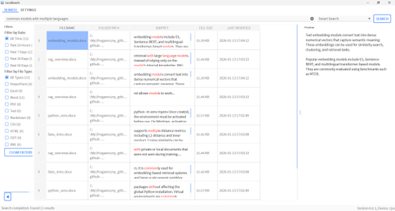

<p align="center">
  
</p>

[English](./README.md) | [中文文档](./README-zh.md)

# LocalSearch
A privacy-first pyside6 desktop app for searching for content in your local files and folders, using both lexical (keyword) search (BM25) and embedding similarity. Compatible with Windows, Linux, and MacOS. 

The UI design is inspired by  [gety.ai](https://gety.ai/). 

# Why LocalSearch
Have you ever tried to **search for something in the content of your hundreds of documents** on local computer, but **can't remember  the words exactly**? For instance, you want to search for "solar power", but the files actually use the term "photovoltaic arrays". 

This app provides you the ability to search for file content (and file names, paths), using both meaning (semantic search) and traditional keyword search (BM25) at the same time.

**Key features**:
- Platform compatibility: Windows, Linux, MacOS
- No need to change the format of your existing documents (no need to migrate into proprietary knowledgebase formats)
- Hybrid search (embedding + lexical)
- Many supported formats: pptx, docx, md, txt, xlsx, csv, md, pdf, html, odt, ....
- Search result preview in a preview panel
- Filter search results by date and file type
- Selecting which folders to include for search
- Search results highlighting
- Multilingual support: Embedding model supports around 100 languages including English, Chinese  (see [details](https://huggingface.co/intfloat/multilingual-e5-small)) 
- GPU support for faster text embedding computation
- Security and privacy: works entirely offline
- Automatically monitor for file content changes
- Highly optimized for performance

# Screenshot


# Comparison with other similar tools
Some tools, like Everything (on Windows) only search for file names by default, and lack the ability to search for file content semantically. Using Everything for content search is slow because it does not build an index. 

There are many new tools that have the hybrid search feature, like Cherry Studio, AnythingLLM, Maxkb, FastGPT,Obsidian, Logseq, etc. 

However, **no single one has the following properties simultaneously**: 
- working completely offline, support for multiple file formats
- not requiring setting up a huge docker container, having a native GUI
- supporting multiple languages (e.g., additional tokenization is required for languages like Chinese)
- not requiring users to manually migrate documents into a proprietary knowledgebase. 

That's why I developed this app. 

# Installation and usage
`LocalSearch` can be used on Windows, Linux, and MacOS (not tested), as long as pyside6 and other required packages can be installed. 

You can directly **download it from the release files** if you are on Windows. The release file is based on DirectML which can utilize GPU, but its performance may be slightly worse than CUDA. Otherwise, follow the following steps:

First, download the repo (download zip file) or 
```
git clone https://github.com/diqbpow3c/LocalSearch.git
cd LocalSearch
```
You might also need to use `git lfs pull` if the onnx model files are not properly downloaded to the `resources/embedding_model` directory.

## Requirements
It is highly recommended to create a virtual environment, since this repo requires uninstalling orjson due to bugs with the `bm25s` package, which might break your existing dependencies. 

```
conda create -n LocalSearch python=3.13
conda activate LocalSearch
# for cpu usage
pip install -r ./requirements.txt
# for CUDA GPU usage
# Make sure torch (GPU version) is installed, e.g., running
pip install torch --index-url https://download.pytorch.org/whl/cu126 (or whatever cuda version you like)
pip install -r ./requirements_gpu.txt
pip uninstall orjson
```
You can also choose `requirements_windows_DirectML.txt` which supports various GPUs on Windows. If you are on Linux or MacOS, modify the `onnxruntime` part in the requirements, and install one variant according to [Onnxruntime execution providers](https://onnxruntime.ai/docs/execution-providers/).

## CPU usage

Directly run 
```aiignore
python main.py
```

## GPU usage
`LocalSearch` uses `onnxruntime-gpu` or `onnxruntime-directml` (or other variants, depending on your choice) for calculating the text embeddings. 

To run the app using GPU, use
```aiignore
python main.py 
```
The code automatically detects whether your hardware supports GPU acceleration.

# Advanced configurations
## Changing embedding model
By default, the program uses the multilingual-e5-small model for embedding. You can place your `model.onnx`, tokenizers and replace the ones in `resources/embedding_model`. 

Then, go to `configs.py` and modify the `EMBEDDING_MODEL_TOKEN_LENGTH` `EMBEDDING_DIM` variables accordingly.

By default, when your computer has a GPU, it will prefer using the `model_gpu.onnx` file by default, and fallback to `model.onnx` if `model_gpu.onnx` is non-existent.

You may want to switch to heavier models like multilingual-e5-base, BGE-M3, EmbeddingGemma-300M, if your GPU is powerful and you don't have too many files for indexing. 

# Limitations
This software currently considers English and Chinese as the primary supported languages for documents, in the sense that it uses `rjieba` for Chinese-specific tokenization (word segmentation). However, the embedding model supports over 100 languages, and languages that naturally use spaces as the word delimiter should work normally without any issues. You can change `rjieba` to other language-specific tokenizers if your documents primarily contain Japanese, Korean, or other languages that do not use spaces as delimiter of words.

To the best of my knowledge, there is currently no Python library for the task of word segmentation for all languages, including Chinese, Japanese, Korea, Thai, etc.

Currently, no OCR is performed on image files and PDF files (only the embedded text in PDFs is extracted), due to resource usage, speed, and large app size. But you can modify the code easily by utilizing capabilities of the `unstructured` package.

For better performance on CPU and smaller app size, heuristics-based reranking is performed instead of using a reranker model (like flashrank).